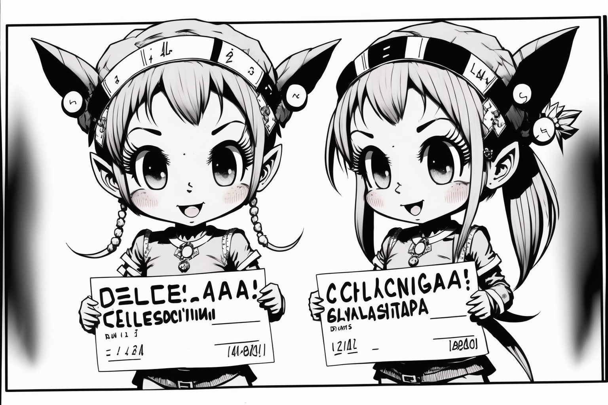

# Advent of Code 2022

```
Hark ye, gentle visitor, lend an ear
To my Advent of Code 2022 solutions here
In this repository, thou shalt find
My solutions to the puzzles, written in Rust divine

Advent of Code 2022 was a time of great delight
For 'twas when ChatGPT was released to our sight
I used its power, and GitHub copilot too
To solve the puzzles and learn something new

Midjourney I used as well, to create art
For each day of the challenge, a work of heart
I do hope thou enjoyest my solutions, my dear
And find them helpful in thy own journey here.
```

## Day 1


## Day 2


## Day 3


## Day 4



## Day 5


## Day 6


## Day 7


## Day 8


## Day 9


## Day 10


